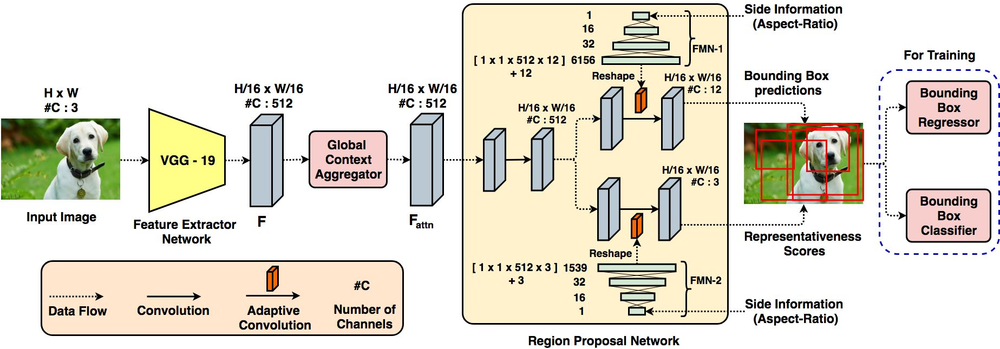
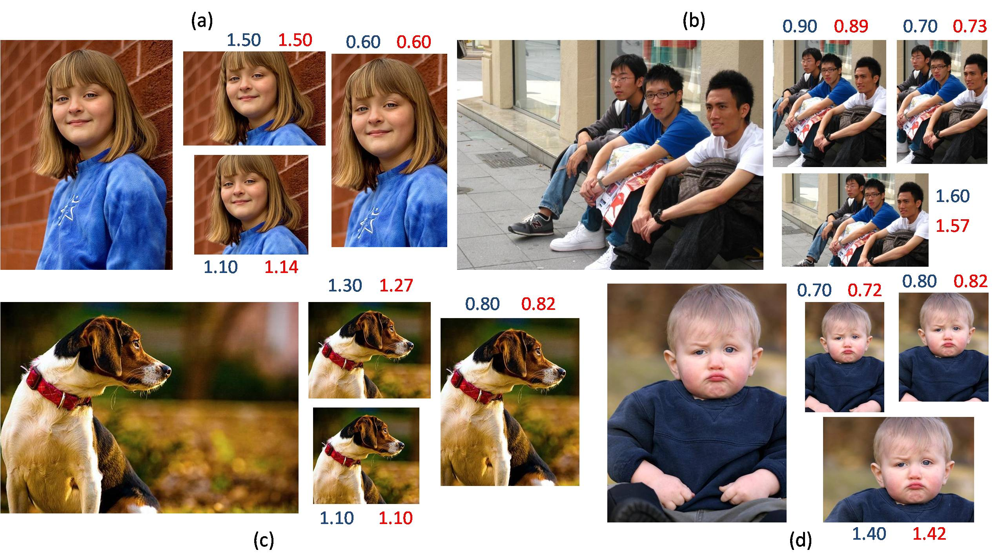

# User Constrained Thumbnail Generation using Adaptive Convolutions [[paper](https://arxiv.org/abs/1810.13054)]
The paper proposes a deep neural framework to generate thumbnails of any size and aspect ratio, even for unseen values during training, with high accuracy and precision. It uses Global Context Aggregation (GCA) and a modified Region Proposal Network (RPN) with adaptive convolutions to generate thumbnails in real time. GCA is used to selectively attend and aggregate the global context information from the entire image while the RPN is used to predict candidate bounding boxes for the thumbnail image. Adaptive convolution eliminates the problem of generating thumbnails of various aspect ratios by using filter weights dynamically generated from the aspect ratio information.

### Architecture

### Generated Thumbnails

The original image is shown on the left with the generated thumbnails on the right. The query aspect ratio is given in blue and the aspect ratio of the generated thumbnail is given in red.

### Code
The code is written in Python 3 with Tensorflow 1.6. The pretrained weights for the custom VGG-19 model can be found [here](https://drive.google.com/file/d/1b9QAd2PrcAVacDgEomoUehEY1IzlZgoB/view?usp=sharing).

### Dataset
The dataset used can be found [here](https://www.dropbox.com/s/760jyienh2gjcby/Thumbnail%20Data%20Set.zip?dl=0).

## Citation
If you find this work useful in your research, please consider citing:

    @article{kishore2018user,
    title={User Constrained Thumbnail Generation using Adaptive Convolutions},
    author={Kishore, Perla Sai Raj and Bhunia, Ayan Kumar and Ghose, Shuvozit and Roy, Partha Pratim},
    journal={arXiv preprint arXiv:1810.13054},
    year={2018}
    }
